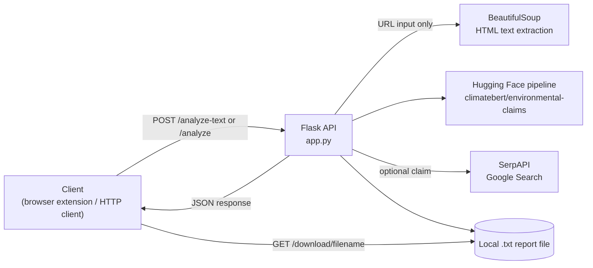
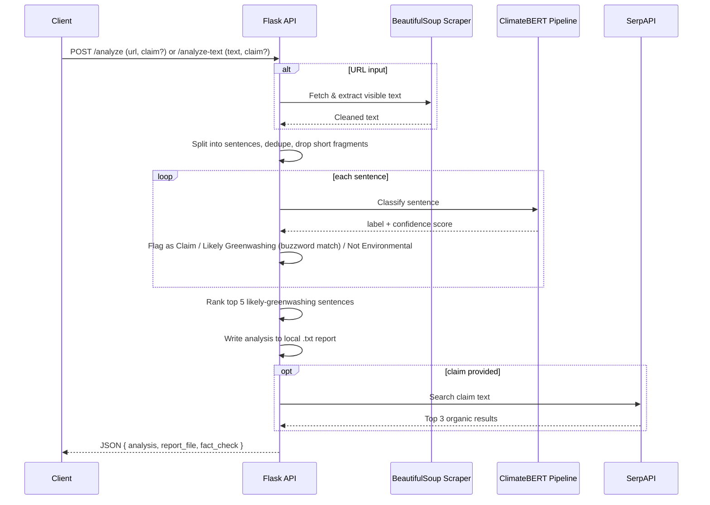

# EcoScan: Greenwashing Detector

A Flask backend that uses a fine-tuned climate NLP model and buzzword heuristics to flag likely greenwashing in environmental claims, with optional fact-checking against live search results.


## Table of Contents

- [Overview](#overview)
- [Problem Statement](#problem-statement)
- [Solution](#solution)
- [Features](#features)
- [Architecture](#architecture)
- [Tech Stack](#tech-stack)
- [Project Structure](#project-structure)
- [System Workflow](#system-workflow)
- [Installation](#installation)
- [Configuration (.env)](#configuration-env)
- [Running Locally](#running-locally)
- [API Documentation](#api-documentation)
- [Machine Learning Pipeline](#machine-learning-pipeline)
- [Author](#author)

## Overview

EcoScan is a backend service that analyzes text or a web page's content and classifies each sentence as a genuine environmental claim, likely greenwashing, or unrelated. It optionally cross-checks a specific claim against live Google search results for supporting evidence. The API is CORS-enabled, indicating it is designed to be consumed by a browser-based client (e.g., a Chrome extension) rather than used standalone.

## Problem Statement

Brands increasingly use vague or unverifiable environmental language ("eco-friendly," "carbon neutral," "sustainably sourced") in marketing copy without substantiating those claims. Manually distinguishing a genuine, verifiable environmental claim from vague greenwashing language requires domain knowledge and is impractical to do at scale across web content.

## Solution

EcoScan automates this triage in two layers:

1. A **ClimateBERT classification model** determines whether each sentence is an environmental claim at all.
2. A **buzzword heuristic** flags sentences that use common greenwashing language but were *not* confidently classified as a genuine claim, surfacing them as "likely greenwashing."

A claim can then optionally be fact-checked by searching for corroborating sources via SerpAPI.

## Features

| Feature | Description |
|---|---|
| Text analysis | Classifies each sentence of a submitted text block as an environmental claim, likely greenwashing, or unrelated |
| URL analysis | Scrapes a web page's visible text (via BeautifulSoup) and runs the same sentence-level analysis |
| Buzzword detection | Cross-references ~40 common sustainability buzzwords/phrases to flag vague or unsubstantiated claims |
| Top-suspects ranking | Surfaces the top 5 highest-confidence "likely greenwashing" sentences per request |
| Fact-checking | Looks up a specific claim via SerpAPI (Google search) and returns the top 3 supporting/contradicting sources |
| Downloadable reports | Each analysis is saved as a text report on the server and can be retrieved via a download endpoint |

## Architecture



## Tech Stack

| Layer | Technology |
|---|---|
| Language | Python |
| Web framework | Flask, Flask-CORS |
| NLP / ML | Hugging Face Transformers (`climatebert/environmental-claims`) |
| Web scraping | BeautifulSoup4, Requests |
| Fact-checking | SerpAPI (Google Search API) |
| Production server | Gunicorn (listed in dependencies) |

## Project Structure

```
Greenwashing-Detector/
├── app.py             # Flask app: routes, scraping, classification, fact-checking
├── requirements.txt   # Python dependencies
└── README.md
```

## System Workflow



## Installation

**Prerequisites:** Python 3.8+

```bash
git clone https://github.com/KAVYAJOSHI1/Greenwashing-Detector.git
cd Greenwashing-Detector
pip install -r requirements.txt
```

## Configuration (.env)

The service currently requires a **SerpAPI key** for the fact-checking feature, set directly as the `SERPAPI_KEY` constant near the top of `app.py`.

> **Security note:** Hardcoding API keys in source is not safe for a public repository. Before deploying or sharing this project, move the key to an environment variable (e.g., load it with `os.getenv("SERPAPI_KEY")` and pass it via a `.env` file excluded from version control), and rotate any key that has already been committed to the repository's history.

| Variable | Required | Purpose |
|---|---|---|
| `SERPAPI_KEY` | Yes, for fact-checking | Authenticates requests to SerpAPI's Google Search endpoint |

## Running Locally

```bash
python app.py
```

The Flask development server starts on `http://127.0.0.1:5000` with debug mode enabled.

## API Documentation

### `POST /analyze-text`

Analyzes a raw block of text.

**Request body:**
```json
{
  "text": "Our packaging is 100% eco-friendly and carbon neutral.",
  "claim": "optional specific claim to fact-check"
}
```

**Response:**
```json
{
  "analysis": "🔎 Full Analysis:\n- ...",
  "report_file": "greenwashing_report_ab12cd34.txt",
  "fact_check": null
}
```

### `POST /analyze`

Scrapes a URL and analyzes its visible text content.

**Request body:**
```json
{
  "url": "https://example.com/sustainability-page",
  "claim": "optional specific claim to fact-check"
}
```

**Response:** Same shape as `/analyze-text`.

### `GET /download/<filename>`

Downloads a previously generated report file (`report_file` value returned by `/analyze` or `/analyze-text`).

## Machine Learning Pipeline

1. **Sentence segmentation:** input text is split on sentence-ending punctuation and deduplicated; fragments shorter than 5 words are discarded.
2. **Classification:** each remaining sentence is passed through the Hugging Face `text-classification` pipeline using the `climatebert/environmental-claims` model, producing a label and confidence score.
3. **Tagging:**
   - `LABEL_1` → tagged as a genuine ✅ Environmental Claim.
   - Not `LABEL_1` but contains a known buzzword → tagged as ⚠️ Likely Greenwashing.
   - Otherwise → tagged as 🤔 Not an Environmental Claim.
4. **Ranking:** sentences flagged as likely greenwashing are deduplicated, sorted by confidence score, and the top 5 are surfaced separately.
5. **Reporting:** the full annotated analysis and the top-5 list are written to a local `.txt` file with a UUID-based filename for later download.

## Author

**Kavya Joshi**
[Portfolio](https://kavyajoshi1.github.io/) · [LinkedIn](https://linkedin.com/in/kavya-joshi-3765742b0) · [GitHub](https://github.com/KAVYAJOSHI1)
